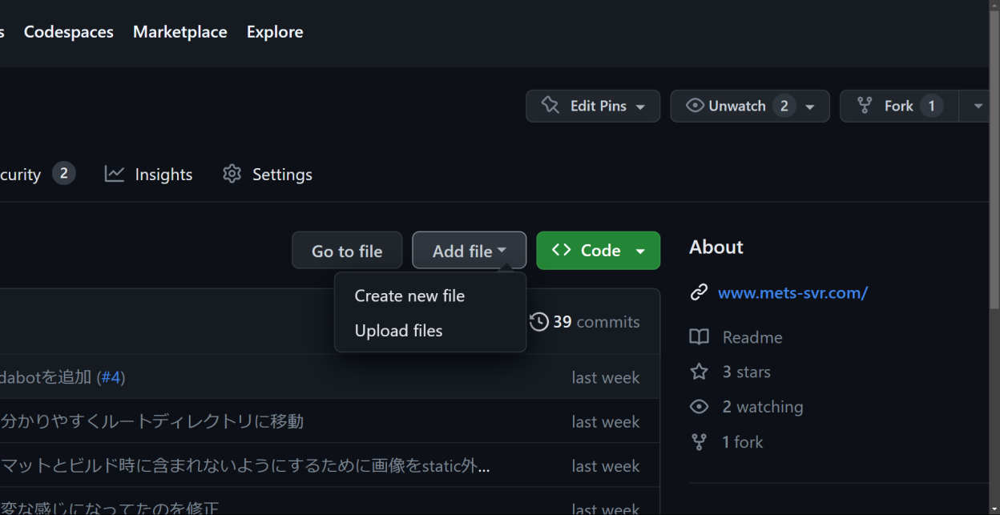

---
authors:
  - Crab55e
tags:
  - management
  - write
  - blog
title: ブログ記事の書き方解説
date: 2023-03-25
---

まったく何も知らない状態から Met's 鯖のブログを書く方法を 1 から解説します。

<!-- 見出し -->

## 必要なもの

- PC(最悪スマホだけでも可)
- メールアドレス

## 大まかな順序

1. [GitHub アカウントを作成する](#github-アカウントを作成する)(★★☆☆☆)
2. [Mets-org に参加する](#mets-org-に参加する)(★★☆☆☆)
3. [用語について理解する](#github-の用語について)(★★★☆☆)
4. [著者の一人として登録する](#著者の一人として登録する)(★☆☆☆☆)
5. [基本的な構文を覚える](#記事を作成する)(★★☆☆☆)

> ★ むずかしさ

### GitHub とは

GitHub とは世界中の開発者が集まってコードやプログラムを共有している SNS です。
GitHub にはコードを管理するために便利な仕組みがたくさんあり、そのほかにも色々な機能があります。
それらの機能を使ってブログページの管理や公開をしています。

## GitHub アカウントを作成する

次の手順を踏み、GitHub のアカウントを作成します。
既に GitHub のアカウントを持っている人はこの手順を飛ばして [次のセクション](#mets-org-に参加する)から始めてください。

### 1. GitHub のページを開く

[ここから GitHub](https://github.com)を開いて、"Sign up"を押します


*githubのトップページ画像*

### 2. 情報を入力する


*メールアドレスや、パスワードなどを入力して認証を受ける*

- **Enter your email**にはメールアドレス
- **Create a password**にはパスワード
- **Enter a username**にはユーザー名

をそれぞれ入力します。

その下にある

> 「Would you like to receive product updates and announcements via email?
> Type "y" for yes or "n" for no」

この質問は GitHub からのアップデートやアナウンスなどの情報をメールで受け取るかどうかを`yes(y) or no(n)`で答えます。
受け取りたい場合は`y`を入力して次へ進みます。

ロボット認証が終わったら、**Create account**を押すことで設定したメールアドレスに認証コードが送られます。
そのコードを入力するとアカウントを作成出来ます。
認証出来たら、次の手順に移りましょう。

## 3. プロフィールを設定する

プロフィールを設定します、アカウントのアイコン画像などがあれば用意しておきましょう。(任意)


この画像のような画面になったら、GitHubからの質問が始まります。

この質問はスキップすることができるので、答えたくない場合は画面下にある `Skip personalization` を押しましょう。

質問が終わったなら、次はプロフィールを設定しましょう。

[プロフィール設定](https://github.com/settings/profile) から自分好みにプロフィールを設定することができます。

## Mets-org に参加する

Mets-org のメンバーとして追加します。

Mets-org とは GitHub 上にある Met's サーバーのグループです。
Mets-org には Met's サーバーにいる何人かの開発者やブログの著者などが集まっています。

### 1. 招待を送ってもらう

Mets-org の管理者に招待を送ってもらいます。
Discord のチケットや会話チャンネルなどでお願いしてみましょう。

### 2. 招待を承認する

GitHub にある [Mets-org](https://github.com/Mets-org) のページを開いたら、横に Join や Accept みたいなボタンがあるのでそれをを押して承認しましょう。

承認の仕方がわからない、承認できない場合は Discord で Crab55e にヘルプを求めましょう。

招待を承認することで、あなたは Mets-org のメンバーの一員になり、ファイルやプロジェクトなどを変更・管理する権限を得られます。

## GitHub の用語について

記事を書いたり、GitHub上で共同作業を行う上で理解しておくべき最低限の用語について解説します。

ちょっと難しい用語もありますが、頑張って覚えましょう。

| 用語の名前| 読み| 説明|
| -------- | --- | --- |
| Repository| リポジトリ| GitHub でのプロジェクトの最小単位で、 `Repository` といいます。 Mets-org のサイトを管理するこのプロジェクトは、`www.mets-svr.com` という名前のリポジトリに置かれています|
| Commit| コミット| ファイルやフォルダなどの構造への変更のチェックポイントを作成します|
| Push | プッシュ | 作成したコミットをリモートリポジトリ(GitHub上) にアップロードして反映します |
| Issue| イシュー| Issue を作成してバグの報告や改善点などの議論など行います|
| Merge | マージ | 自分のブランチのコミットを他のブランチ(mainブランチなど)に対してマージしてブランチを統合します |
| Pull request | プルリクエスト| [Pull requests](https://github.com/Mets-org/www.mets-svr.com/pulls)欄などから作成し、既存のブランチに対して変更を反映のマージをリクエストします |
| Organization | オルガナイゼーション | 複数のメンバーでリポジトリを共同管理できる組織、グループ|

### 使い方

- 「mets 鯖の Organization のリポジトリに豚の調理方法についての新しいブログ記事をコミットする」
- 「美味しいチャーシューの作り方についての記事を作ったので、mets 鯖のブログに入れてほしい、プルリクを送ろう」
- 「昨日書いた豚の調理方法についての記事にミスがあった、今すぐ修正するのはめんどくさいからとりあえず Issue を出しておこう」

ここからたまに役に立つかもしれない上級用語

| 用語の名前 | 読み | 説明 |
| ---------- | ---- | ---- |
| Markdown | マークダウン | 簡単に文字の大きさやスタイルなどを整えた文章(リッチテキスト)を作成できる表記方法 |
| Contributor | コントリビューター | リポジトリやその内容について貢献した人 |
| Deploy | デプロイ | 変更したデータを実際に使う場所に設置すること（ここでは主に変更した記事が実際の web サイトに反映されることを表します） |

## 著者の一人として登録する

ブログ記事の作者として登録できるように [`authors.yml`](https://github.com/mets-org/www.mets-svr.com/blob/main/blog/authors.yml) に自分を著者の一人として追加します。

[`authors.yml`](https://github.com/mets-org/www.mets-svr.com/blob/main/blog/authors.yml) には以下のようにプロフィールを記述します。

```yaml
<MCID>:
  name: <名前>
  title: <簡単な自己紹介>
  url: <SNSなど自分のプロフィールのリンク>
  image_url: <プロフィール画像のリンク>
  email: <連絡先メールアドレス：任意>
```

プロフィール画像のリンクは imgur などのサービスを利用するか、mets-svr.com で提供します。

email の部分を設定したくない場合は、省略することができます。MCID の部分は、今後の工程で使うので覚えておきましょう。

## 記事を作成する

GitHub 上にブログページを作成します

### 1. リポジトリを開く

[Mets-org/www.mets-svr.com](https://github.com/Mets-org/www.mets-svr.com) を開き、
その中にある`blog`というフォルダを開きます。そして`Add file`、`Create new file`を押します。


*blog フォルダにファイルを作成する*

`Name your file...` の欄にファイル名を書きます、ここはなるべくシンプルでわかりやすい英語の名前にしましょう。

例として、和風のおしゃれなおうちの作り方についての記事であれば、`build_japanese_house.md` といった名前が適しているでしょう。
他にも、クリーパートラップの作り方についての記事であれば、`build_gunpowder_farm.md`といった名前でも良いでしょう。

ファイル名は必ず、`.md`で終わります。
また、空白は使用せず、代わりに `_` (アンダーバー)を使用します。
なるべく既存の命名規則にしたかがった名前を付けるようにしましょう。

## 2. 記事を作成する

ついにあなたの記事を書く時です！！！

記事を書く際には、マークダウンというものを使用します。マークダウンとは、文や表、画像、リンクなどを**簡単にわかりやすく**記述する方法です。
マークダウンについては既に分かりやすい記事があるのでそちらを読んでみてください。

- [Markdown記法 チートシート](https://gist.github.com/mignonstyle/083c9e1651d7734f84c99b8cf49d57fa)

ブログを書く際、一番さ所には以下のようなテンプレートを書いてから、その下に記事の内容を書いていきます。

```md
---
title: 記事のタイトル
authors:
  - MCID
tags:
  - blog
  ...
---

記事の内容
...
```

`MCID` は [前の工程](#著者の一人として登録する) で登録した ID を使用します。
その下にタグを書くことでその記事がどんなカテゴリにものなのか定義します。
タグは日本語も使用することができます。

> [!NOTE]
> 複数の人と記事を書く場合は以下のように書きます。

```md
---
title: タイトル
authors:
  - MCID
  - MCID1
tags:
  - blog
  - collaboration
---

記事の内容
```

## 3. 投稿する

あなたが情熱をこめて作成した最初の記事をコミットしましょう。

作成した記事をコミットするには、右上にある `Commit changes...` をクリックします。
コミットするときはコミットメッセージを入力します。`Commit message` の欄にどんな変更をしたかを簡潔に書きます。
細かい説明はその下の `Extended description` の欄に入力しましょう。

最後に緑色のボタンを押すことでコミットを作成して、プッシュすることができます。

## さいごに

ここまで記事を読んでいただきありがとうございます。お疲れさまでした、以上で「ブログの書き方解説」は終わりとなります。
今後記事を書いていく上で分からないことがあったらまたこの記事を読み返してください。

誤字の修正や情報の追加など、このドキュメントを改善する案などあれば気軽にPull requestを作成してください。
